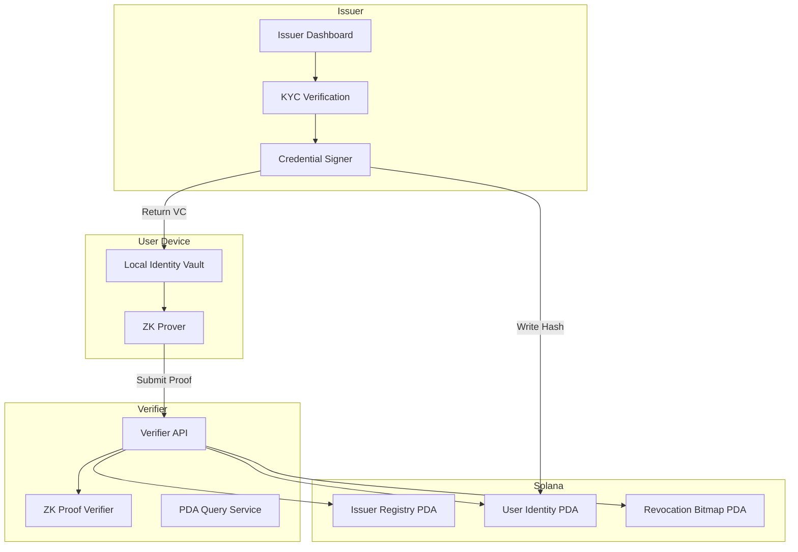
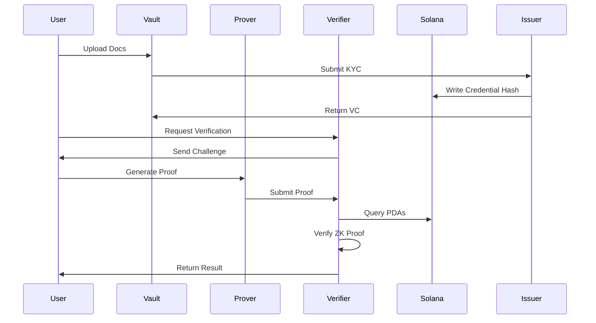
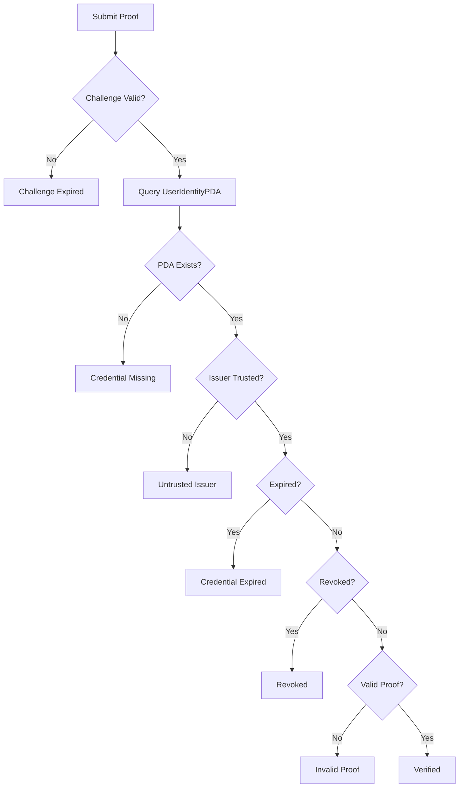

# SolidKYC – Design Document (Condensed)

This design document consolidates and compresses the content of both the v2 Design Document and PRD while ensuring clarity, complete architecture coverage, and inclusion of required mermaid diagrams.

---

## 1. System Overview

SolidKYC is a decentralized ZK‑KYC framework on Solana. It enables selective disclosure (e.g., Age > 18) via zero‑knowledge proofs using user‑owned encrypted storage and Solana PDAs for trust anchoring.

Core components:

- Local Identity Vault (off‑chain, encrypted) - IndexedDB
- Issuer (VC creation, on‑chain anchoring)
- ZK Prover (browser/desktop)
- Solana Program (PDA registry, identity, revocation)
- Verifier API (challenge issuance, ZK verification)

---

## 2. Architecture

### 2.1 High‑Level Architecture

- **User vault** stores encrypted VCs; nothing leaves device except hashed credential & ZK proof.
- **Issuer** signs VC + anchors credential hash to UserIdentityPDA.
- **ZK circuit** verifies: signature validity, hash consistency, age constraint, expiry, challenge binding.
- **Verifier** checks ZK proof & on‑chain PDAs.

### 2.2 Component Architecture Diagram



---

## 3. Detailed Workflows

### 3.1 Credential Issuance

1. User uploads documents → vault.
2. Vault sends docs → Issuer.
3. Issuer reviews, constructs VC, computes `credential_hash`, signs using EdDSA.
4. Issuer writes PDA: hash, issuer pubkey, issued\_at, expires\_at, revocation\_nonce.
5. VC returned to vault; signature validated locally.

Error handling: signature mismatch, Solana write failure, network retry queue.

### 3.2 Proof Generation

Inputs:

- **Private:** full VC, DOB timestamp, issuer signature.
- **Public:** credential hash, issuer pubkey, challenge nonce, current timestamp, expiry, threshold.

Circuit constraints:

- Hash integrity: Poseidon hash matches credential\_hash.
- Signature verification **inside circuit**.
- Age check using timestamp arithmetic.
- Expiry check.
- Challenge binding → prevents replay.

### 3.3 Verification

1. Validate challenge freshness & replay.
2. Query UserIdentityPDA → validate issuer, expiry, revocation nonce.
3. Verify ZK proof cryptographically.
4. Return result.

---

## 4. Solana Program Design

### 4.1 PDAs

**IssuerRegistryPDA:** admin, list of issuers. 
**UserIdentityPDA:** credential\_hash, issuer, revocation\_nonce, issued\_at, expires\_at, user. 
**RevocationBitmapPDA:** issuer, bitmap vector.

### 4.2 PDA Details & Space
1. **Program Config**:
```
pub struct ProgramConfig {
    pub admin: Pubkey,    // 32 bytes
    pub version: u8,      // 1 byte
    pub bump: u8,         // 1 byte
}

impl ProgramConfig {
    pub const SIZE: usize = 32 + 1 + 1;
}
```
2. **Issue Registry**:
```
#[account]
pub struct IssuerRegistry {
    pub admin: Pubkey,               // 32
    pub issuers: [Pubkey; 32],       // 32 * 32 = 1024
    pub count: u8,                   // how many populated entries
    pub bump: u8,                    // 1
}

impl IssuerRegistry {
    pub const SIZE: usize = 32 + (32 * 32) + 1 + 1; // ≈ 1090 bytes
}
```
3. **User Identity**:
```
#[account]
pub struct UserIdentity {
    pub owner: Pubkey,              // 32
    pub issuer: Pubkey,             // 32
    pub credential_hash: [u8; 32],  // 32
    pub revocation_nonce: u64,      // 8
    pub issued_at: i64,             // 8
    pub expires_at: i64,            // 8
    pub bump: u8,                   // 1
}

impl UserIdentity {
    pub const SIZE: usize = 32 + 32 + 32 + 8 + 8 + 8 + 1; // = 121 bytes
}

```

### 4.2 Instructions

- register\_issuer
- issue\_credential
- revoke\_credential
- update\_expiry

Validation includes issuer authority checks, expiry constraints, rent, and conflicts.

---

## 5. ZK Circuit Design

### 5.1 Inputs

Private: full VC data, DOB timestamp, EdDSA signature. Public: credential\_hash, issuer\_pubkey, challenge\_nonce, current\_timestamp, expiry, age threshold.

### 5.2 Constraints

- `verify_eddsa(issuer_pubkey, credential_hash, signature)`
- Hash check: `poseidon_hash(full_vc_data) == credential_hash`
- Age: `(current_timestamp - dob) >= threshold * 31557600`
- `current_timestamp < expiry`
- Challenge binding via Poseidon

### 5.3 Extended Circuit Notes

- Poseidon‑friendly data encoding.
- Constraint budget planned for < 120k constraints.
- Future: Merkle inclusion.

---

## 6. Off‑Chain Components

### 6.1 Local Identity Vault (IndexedDB)

- AES‑256‑GCM encrypted
- Key: derived from wallet signature
- Auto‑locking
- Stores: VCs, signatures, raw docs
- API supports store/get/list/delete + generateProof

### 6.2 Verifier Backend

- Issues challenge nonces
- Verifies ZK proofs
- Queries PDAs
- Enforces rate limits, retries RPC calls

---

## 7. Error Handling

Categories:

- Issuance errors (invalid document, RPC failure)
- Proof generation errors (credential expired, proving failure, memory exhaustion)
- Verification errors (issuer untrusted, PDA missing, timestamp stale, invalid proof)

---

## 8. Performance Targets

- Proof generation <5s mobile, <2s desktop
- Verification <500ms
- End‑to‑end <2s
- PDA query <200ms

Optimizations: Groth16, snarkjs, caching issuer registry.

---

## 9. Security Model

- No PII on‑chain
- Signature verification inside ZK circuit
- Challenge‑nonce replay protection
- Expiry + revocation enforced on‑chain + in‑circuit
- Vault key unrecoverable (documented)

Threat mitigations for forged credentials, replay attacks, compromised issuers.

---

## 10. Diagrams

### 10.1 Sequence Diagram



### 10.2 Error Flow Diagram



---

## 11. Tech Stack

**Frontend:** Next.js, Wallet Adapter, IndexedDB **ZK:** Circom (version 2.2.3), Groth16, snarkjs **Backend**: Rust (Axum — Verifier API) **Solana:** Anchor, PDAs, Web3.js **Security:** AES‑256‑GCM vault, EdDSA signatures

---

## 12. Public Inputs (ZK → Verifier → PDA Binding)

The zero‑knowledge circuit exposes the following **public inputs**, which the
verifier uses to validate the proof against on‑chain PDAs:

```js
public_inputs = {
  credential_hash,     // SHA256/Poseidon commitment anchored in UserIdentityPDA
  issuer_pubkey,       // Matches trusted issuer in IssuerRegistryPDA
  subject_pubkey,      // User wallet binding (prevents proof reuse by others)
  revocation_nonce,    // Ensures proof matches latest on-chain revocation state
  challenge,           // Anti-replay freshness challenge from verifier
  current_timestamp,   // Bound to verifier-issued timestamp
  expires_at,          // Credential expiration (verified in-circuit)
  threshold            // Age threshold (e.g., 18 years)
}
```
---

## 13. Signature Verification Strategy

SolidKYC supports two verification modes:

### Option A — In-Circuit Signature Verification (High Privacy Mode)
- EdDSA signature on the credential is verified inside the ZK circuit.
- Strongest security and privacy guarantees.
- Adds more constraints → slower proving time.

### Option B — Off-Chain Signature Verification at Issuance (MVP Mode)
- Issuer signature is verified by the Vault when storing the VC.
- ZK circuit verifies only the credential_hash.
- Much faster proof generation (<2s desktop, <5s mobile).

### MVP Choice
For the MVP, **Option B** is used for improved performance.
Signature verification inside the ZK circuit is planned for future versions.

---

## 14. PDA Size Table (Rent & Storage Overview)

| PDA Name             | Fields Included | Approx Size | Notes |
|----------------------|-----------------|-------------|----------------------------|
| ProgramConfigPDA     | admin, version  | ~34 bytes   | Very small, global config |
| IssuerRegistryPDA    | admin + 32 issuers | ~1090 bytes | Fixed-size issuer list for MVP |
| UserIdentityPDA      | owner, issuer, hash, nonce, times | ~121 bytes | Core identity anchor |
| (Optional) RevocationBitmapPDA | issuer, bitmap | 16 KB+ | Not required for MVP |

**Goal:** Keep all MVP PDAs under **1 KB** for low rent and easy maintenance.
UserIdentityPDA and ProgramConfigPDA already meet this requirement.


---

## 15. Threat Model Summary

SolidKYC enforces a strong security posture based on:
- **Zero-Knowledge Proofs:** No PII leaves the user device.
- **Issuer Trust Model:** Only issuers listed in IssuerRegistryPDA can sign credentials.
- **Replay Protection:** Challenge + timestamp + revocation_nonce prevent proof reuse.
- **Wallet Binding:** Proofs are bound to the user's public key; cannot be forwarded.
- **On-chain Anchoring:** Credential hashes + revocation state immutably stored in PDAs.

### Key Threats Mitigated

- **Forged Credential:**
  Mitigated via issuer signature verification (in-circuit or off-chain at issuance).
- **Stolen Proof Reuse:**
  Prevented using subject_pubkey binding + challenge nonce.
- **Revoked Credential Still Used:**
  Mitigated via revocation_nonce mismatch and expiry checks both in-circuit and on-chain.
- **Issuer Misbehavior:**
  Controlled via admin-managed issuer registry on-chain.
- **PII Leakage:**
  Vault encryption + no PII on-chain + ZK selective disclosure ensures safety.
- **RPC Tampering:**
  Back-end independently verifies ZK proof + PDA state, preventing false acceptance.

---

## 16. Future Enhancements

- Multi‑credential Merkle tree
- Nullifiers for unlinkability
- Mobile proving service
- Multi‑issuer federation
- Biometric ZK circuits
- Social recovery for vault
- EUDI compatibility

---

**Version:** v1 (MVP Design Document)

